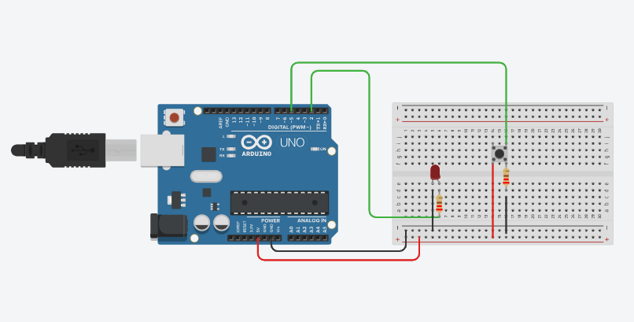
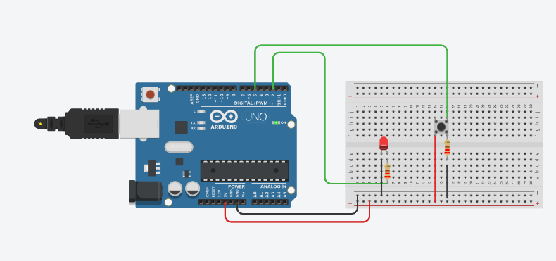

# Task1-Electronics

## Turn LED ON and OFF With Push Button

### Idea:
Power on the LED when the button is pressed, and power off the LED when the button is not pressed.

### Hardware Required:
- Arduino UNO.
- Breadboard.
- LED.
- Push button.
- 220 Ohm resistors.
- male to male wires.

  ### Circuit:

  - When the button is not pressed:
 
    
 
  - When the button is pressed:
    

  

  ### Code:

## 5x5 LED Matrix
