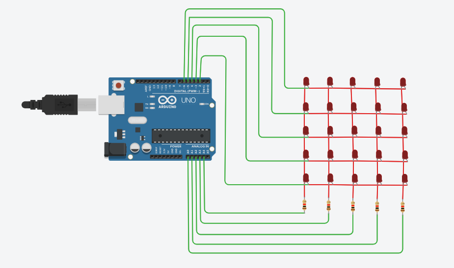

# Task1-Electronics

## Turn LED ON and OFF With Push Button

 ### Idea:
  Power on the LED when the button is pressed, and power off the LED when the button is not pressed.

 ### Hardware Required:
  - Arduino UNO.
  - Breadboard.
  - LED.
  - Push button.
  - 220 Ohm resistors.
  - male to male wires.

  ### Circuit:

  - When the button is not pressed:
 
      
 
  - When the button is pressed:
    
      


  ### Code:

```
int led=2;
int PushButton=5;
int button;

void setup()
{
  
  pinMode(led, OUTPUT);
  pinMode(PushButton, INPUT);
  Serial.begin(9600);
}

void loop()
{
  
  button=digitalRead(5);
  
  if(button==HIGH)
  {
    digitalWrite(led,HIGH);
    delay(3000);
  }
  else
  {
     digitalWrite(led,LOW);
  }
  
}
```
  ### Tinkercad link:

      https://www.tinkercad.com/things/dksbH09xmc7?sharecode=gaO8uukPS-zQfJDkhBOqCBr6Dx06qi3JcHrlQG23NlI


## 5x5 LED Matrix

### Hardware Required:
  - Arduino UNO.
  - Breadboard.
  - LEDs.
  - 220 Ohm resistors.
  - male to male wires.


### Circuit:

  


  

### Code:

```
const int X1 = 6;  
const int X2 = 5; 
const int X3 = 4;  
const int X4 = 3;  
const int X5 = 2; 

const int Y1=  A4;
const int Y2=  A3; 
const int Y3=  A2; 
const int Y4=  A1; 
const int Y5=  A0; 

void setup()
{
  pinMode(X1, OUTPUT); 
  pinMode(X2, OUTPUT);
  pinMode(X3, OUTPUT);
  pinMode(X4, OUTPUT);
  pinMode(X5, OUTPUT);
  
  pinMode(Y1, OUTPUT);
  pinMode(Y2, OUTPUT);
  pinMode(Y3, OUTPUT);
  pinMode(Y4, OUTPUT);
  pinMode(Y5, OUTPUT);
  
  
}

void loop()
{
  
  digitalWrite(X1, HIGH);
  digitalWrite(X2, HIGH);
  digitalWrite(X3, LOW);
  digitalWrite(X4, HIGH);
  digitalWrite(X5, HIGH);
  
  digitalWrite(Y1, LOW);
  digitalWrite(Y2, LOW);
  digitalWrite(Y3, HIGH);
  digitalWrite(Y4, LOW);
  digitalWrite(Y5, LOW);
  
      
}
```

### Tinkercad link:
    https://www.tinkercad.com/things/3ZZ1lnKawF0?sharecode=Sj17TITvjAq7_FXXRnazr-dtsR8_s2lmPomtPO1GYAk


  


